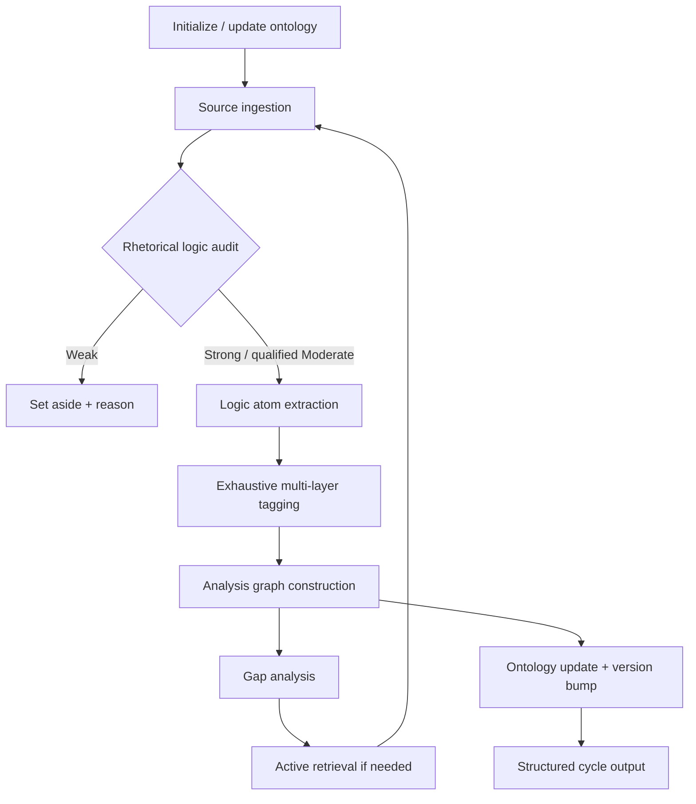
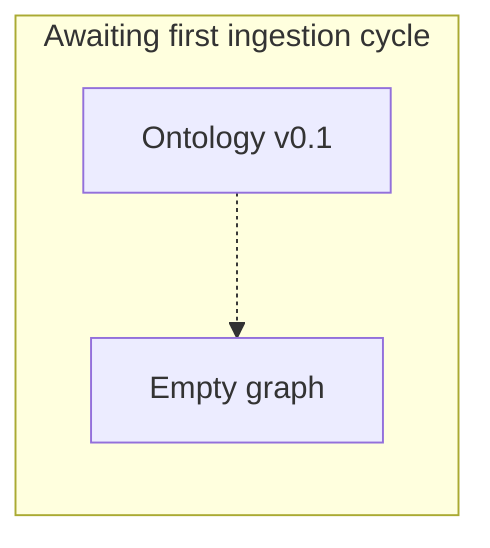

# Hanani Living Semantic Model / Ontology

**Version:** 0.1  
**Graph ID:** `mechanism`  
**Status:** Seed graph — expandable from scholarly mechanisms, not from news cycles  
**Project:** Hanani **reasoning system** (see [`reasoning-system.md`](../reasoning-system.md))  
**Role:** **Graph A** — mechanism/factor semantics for **Layer 2** atom tagging  

This document is **not** a one-off conflict analysis. It is the living, versioned
backbone that logic atoms attach to after passing **Layer 1** rhetorical assessment
([`rhetorical-logic-graph.md`](rhetorical-logic-graph.md)).

---

## 0. Operating principles (non-negotiable)

| Principle | Enforcement |
|---|---|
| Rhetorical logic first | No atom extraction until source passes logic audit |
| Reputation-blind | Outlet size, funding, fame, corpus associations are **ignored** in audit and tagging |
| Exhaustive application | Every atom receives multi-layer tags with step-by-step justification |
| Living model | Changelog + inference notes track stability vs. shift |
| Neutrality on moral verdicts | Mechanisms, evidence, framework — not ideological closure |
| Bias countermeasure | Explicitly flag when default LLM associations are suppressed |

**Default tendency countered:** probabilistic summarization, 1–2 tag shortcuts, prestige-based source acceptance.

---

## 1. Position in the reasoning engine

```
Logic atom → Layer 1 (rhetoric graph) → Layer 2 (this mechanism graph) → assessment record
                                                                    ↓
                                              [later] collective narrative + outcomes
```

## 2. Workflow (when sources are eventually ingested)



1. Initialize or update living ontology (this document).
2. Source ingestion → rhetorical logic filter (mandatory).
3. Logic atom extraction (robust sources only).
4. Exhaustive tagging per atom (all applicable layers).
5. Analysis graph (atoms, sources, concepts, edges).
6. Gap analysis vs. full ontology.
7. Active retrieval → same filter on new material.
8. Ontology update, changelog, stability notes.
9. Structured cycle output (audit, atoms, graph, gaps, correlations).

---

## 2. Rhetorical logic audit criteria

Apply to **every** source before atom extraction. Output audit block first.

| Criterion | Questions |
|---|---|
| **Chain completeness** | Are premises, warrants, and axioms explicit? List enthymemes that would collapse the argument if false. |
| **Evidence integration** | How is evidence weighed? Are counter-explanations and disconfirming evidence considered? |
| **Qualifiers & falsifiability** | Scope conditions, uncertainty, openness to being wrong? |
| **Analytical intent vs. closure** | Causal/mechanistic insight vs. narrative/ideological closure with missing steps? |
| **Update signals** | Willingness to revise with new information or strong counter-reasoning? |

**Qualification scale**

| Score | Proceed to atoms? |
|---|---|
| **Strong** | Yes |
| **Moderate** | Yes, with explicit gaps listed |
| **Weak** | No — set aside with reasons |

```json
{
  "audit_id": "AUDIT-YYYYMMDD-NNN",
  "source_ref": "opaque id — not outlet prestige",
  "robustness": "Strong | Moderate | Weak",
  "enthymemes": ["..."],
  "gaps": ["..."],
  "reputation_ignored": true
}
```

---

## 3. Logic atom schema

```json
{
  "atom_id": "Atom-001",
  "source_ref": "AUDIT-...",
  "text": "verbatim or tight paraphrase of the claim",
  "type": "assertion | causal_claim | analogy | intent_assessment | counterfactual | warrant | premise",
  "layers": ["L1.anarchy", "L3.prospect_loss_aversion"],
  "cross_cutting": ["schelling_focal_point"],
  "historical_anchors": ["cuban_missile_crisis"],
  "tag_justification": "step-by-step link text → ontology element",
  "evidence_for": ["..."],
  "evidence_against": ["..."],
  "alternatives": ["..."],
  "strength": "high | medium | low",
  "uncertainty": "explicit note"
}
```

---

## 4. Layer 1 — Superstructure / foundational structural

*Load-bearing constraints, incentives, and possibilities. Architecture that limits what coalitions and leaders can sustain.*

### 4.1 International anarchy & security dilemma

- **Definition:** No supreme authority; self-help; one actor's security measures reduce others' security (security dilemma).
- **Tag when:** Arguments hinge on relative power, defensive vs. offensive ambiguity, arms/buildup spirals without central enforcement.
- **Inference notes (v0.1):** *Seed only — no theatre-specific inference yet.*

### 4.2 Power distribution / polarity & shifts

- Unipolar / bipolar / multipolar frames; relative capability trajectories; alliance aggregation effects.
- **Tag when:** Balance-of-power claims, hegemonic restraint/overstretch, coalition feasibility.

### 4.3 Nuclear deterrence architecture & MAD logic

- Civilization-scale Chicken; escalation ladders; tactical vs. strategic distinction; commitment problems at the nuclear threshold.
- **Tag when:** Nuclear rhetoric, escalation dominance, damage-limitation vs. assured retaliation logic.

### 4.4 Economic interdependence, sanctions, trade networks, kleptocratic revenue

- Trade weaponization, energy rents, sanctions evasion, elite extraction models feeding war budgets.
- **Tag when:** Economic statecraft, resource curse, sanctions impact chains, corruption–war finance links.

### 4.5 Geographic / strategic fundamentals

- Chokepoints (Hormuz, straits), depth, interior lines, buffer zones, demographic/economic base.
- **Tag when:** Terrain/logistics/geography treated as binding constraints on strategy.

### 4.6 Cross-cutting: Schelling mixed-motive games

- Simultaneous cooperation/competition; bargaining embedded in conflict.
- **Tag when:** Compellence + accommodation mixed; "negotiate while fighting" structure.

---

## 5. Layer 2 — Mid-level processual / institutional / coalitional

*How states and regimes process decisions through institutions, coalitions, and path-dependent structures.*

### 5.1 Selectorate theory & winning coalition size

- Small coalitions → private goods, higher risk tolerance in foreign policy; personalist rule dynamics.
- **Tag when:** Elite patronage, coup-proofing, purge cycles, foreign adventure as domestic rent distribution.

### 5.2 Two-level games (Putnam)

- International bargaining simultaneous with domestic ratification / coalition maintenance.
- **Tag when:** Leader must sell foreign policy at home; domestic audience costs constrain international offers.

### 5.3 Bureaucratic politics & organizational processes

- Standard operating procedures, inter-service rivalry, information stovepipes, incrementalism.
- **Tag when:** "Where you stand depends on where you sit"; organizational outputs ≠ rational unitary actor.

### 5.4 Information / narrative control ecosystems & propaganda

- State media, censorship, bot networks, legal pressure on dissent — as **institutional systems**, not moral labels.
- **Tag when:** Information environment shapes what elites and publics can believe or say.

### 5.5 Path dependence & critical junctures

- Early choices constrain later option sets; contingent events lock in trajectories.
- **Tag when:** "Once X happened, Y range collapsed" — Crimea, Maidan, JCPOA exit, etc. as junctures.

### 5.6 Cross-cutting: Putnam-style entanglement

- Domestic politics entangled with international negotiation games (ratification, two-audience problem).

---

## 6. Layer 3 — Agentic / psychological / cognitive

*Leader and decision-maker cognition — can dominate in personalist systems.*

### 6.1 Prospect theory & loss aversion

- Reference-dependent utility; risk-seeking in losses domain; risk-averse in gains; reference points (status, identity, historical grievance).
- **Tag when:** "Cannot afford to lose face/territory/influence"; gamble to recover losses; sunk-status fights.

### 6.2 Cognitive biases & heuristics

- Overconfidence, confirmation, escalation of commitment, motivated reasoning, availability.
- **Tag when:** Doubling down, ignoring disconfirming intel, analogy-driven leaps.

### 6.3 Personality & Dark Triad (evidence-gated)

- Narcissism/grandiosity, Machiavellianism, low-empathy patterns — **only where text supplies behavioral evidence**, not pop psychology.

### 6.4 Emotional / motivational drivers

- Paranoia, revanchism, honor/revenge, need for control/infallibility.

### 6.5 Mental simulation, counterfactuals & scenario planning

- Internal role-play of hypotheticals; war-gaming rhetoric; pre-mortems stated or implied.

### 6.6 Perception & misperception (Jervis)

| Model | Core mechanism |
|---|---|
| **Spiral** | Defensive actions misread as aggressive → escalation via security dilemma |
| **Deterrence** | Adversary assumed inherently aggressive; credible threats required |
| **Cognitive consistency** | New info assimilated to existing images |
| **Overestimation of influence** | Own signals assumed more controlling than they are |
| **Shared worldview error** | Assuming adversary shares your frame |

- **Tag when:** Intent attribution, misreading mobilization, mirror-imaging, attribution errors.

### 6.7 Cross-cutting: Historical analogies (often misapplied)

- Munich, Cuba, Afghanistan, etc. used as warrants — tag analogy **and** assess misapplication risk.

---

## 7. Layer 4 — Communicative / signaling layer

*Expressive and manipulative surface — what is said vs. what is costly.*

### 7.1 Cheap talk vs. costly signaling (Fearon / Schelling)

- Credibility from sunk costs, tying hands, observable military/industrial moves vs. rhetoric alone.
- **Tag when:** Threats, promises, mobilization announcements, sanctions "deadlines."

### 7.2 Madman theory / unpredictability postures

- Cultivated irrational image for brinkmanship leverage (Nixon tradition and extensions).

### 7.3 Brinkmanship & escalation dominance signaling

- Chicken dynamics; who swerves; controlled escalation as bargaining.

### 7.4 Audience targeting

- Domestic rally vs. international deterrence vs. ally reassurance — same act, multiple audiences.

### 7.5 Propaganda, narrative warfare & moral disengagement

- Framing, dehumanization, victimhood narratives — as **mechanisms**, not truth adjudication.

### 7.6 Cross-cutting: Schelling focal points

- Salient coordination solutions in tacit bargaining (explicit lines, calendar dates, symbolic places).

### 7.7 Cross-cutting: Credible commitments

- Mechanisms making threats/promises believable despite reneging incentives (tripwires, treaty law, audience costs).

---

## 8. Layer 5 — Emergent / dynamic / complex adaptive

*Interactions and feedback over time — pathologies and emergent structures.*

### 8.1 Active game structures

| Game | Mechanism | Tag when |
|---|---|---|
| Prisoner's Dilemma | Mutual defection trap | Sanctions races, verification breakdowns |
| Chicken | Brinkmanship, swerve | Crises, Hormuz incidents, nuclear shadow |
| Repeated games | Reputation, tit-for-tat | Long-running rivalries, ceasefire patterns |
| Focal points | Tacit coordination | Red lines, straits, symbolic dates |

### 8.2 Feedback loops & spirals

- Rhetoric → perception → counter-action → updated assessments; L1 dilemma + L3 loss domain + L4 signals.

### 8.3 Face-saving, cognitive dissonance & "punish before accept"

- Need for costs inflicted or partial victory to justify exit; domestic audience costs.

### 8.4 Path dependence, lock-in, hubris cycles & overreach

- Napoleonic / WWII eastern front patterns as **structural** cautionary anchors — tag mechanism, not analogy alone.

### 8.5 Structural enablement of personalist pathology

- Small coalitions reward intrigue; loyalty games; complexity addiction.

### 8.6 Moral / ethical emergence & inhumane outcomes

- How layers combine to enable population-disregard while "rational" for narrow selectorate — descriptive, not prescriptive.

### 8.7 Cross-cutting: Jervis spiral vs. deterrence in real time

- Same observable act read through different images → different recommended responses.

### 8.8 Cross-cutting: Schelling commitment problems in ongoing interactions

- Promises erode; audience costs decay; new crises require re-establishing credibility.

---

## 9. Historical anchors (seed mappings)

*Use for cross-linking atoms — not as substitutes for evidence in new texts.*

### 9.1 Cuban Missile Crisis (1962)

| Layer | Illustrative mechanisms |
|---|---|
| L1 | Nuclear Chicken; bipolar competition |
| L2 | ExComm bureaucratic politics; alliance consultation |
| L3 | Misperception management; stress under uncertainty |
| L4 | Naval quarantine as costly signal; back-channel cheap talk |
| L5 | Brinkmanship resolution; focal point (missile trade); spiral avoided via direct communication |

### 9.2 Russia–Ukraine (2014 → 2022+)

| Layer | Illustrative mechanisms (hypothesis templates — verify per source) |
|---|---|
| L1 | Security dilemma; energy interdependence; sanctions architecture |
| L2 | Small-coalition / personalist incentives; domestic narrative ratification |
| L3 | Prospect losses (influence, NATO/EU expansion frames); historical identity reference points |
| L4 | Troop buildups as costly signals vs. ultimatum rhetoric as cheap talk |
| L5 | Path dependence from Crimea/Minsk; escalation spirals; commitment problems on ceasefires |

### 9.3 Napoleonic overextension (lighter anchor)

| Layer | Mechanism |
|---|---|
| L5 | Hubris cycle; logistics–ambition mismatch; coalition aggregation |
| L3 | Overconfidence; escalation of commitment |
| L6 | Misperception of Russian winter campaign capacity (historical analogy risk) |

### 9.4 Hormuz / Gulf chokepoint (theatre anchor — seed)

| Layer | Mechanism |
|---|---|
| L1 | Geographic chokepoint; energy market interdependence |
| L4 | Mine/threat rhetoric vs. actual interdiction costs |
| L5 | Chicken dynamics; repeated incident games |

---

## 10. Analysis graph (empty at v0.1)

**Node types:** `logic_atom`, `source`, `ontology_concept`, `historical_anchor`  
**Edge types:** `agrees`, `contradicts`, `complements`, `implies`, `gap`, `supports`, `weakens`



*Adjacency list and populated Mermaid will appear after first source cycle.*

---

## 11. Initial gap inventory (pre-sources)

| Priority | Gap | Resolution need |
|---|---|---|
| High | No atoms for Russia–Ukraine theatre | Ingest robust analytical sources |
| High | No atoms for Hormuz theatre | Same |
| High | Layer 3 Jervis models untested on live text | Audited sources with intent/misperception claims |
| Medium | Kleptocratic revenue (L1.4) unpopulated | Economic / sanctions analysis with explicit chains |
| Medium | Bureaucratic politics (L2.3) thin | ExComm-style organizational accounts |
| Low | Dark Triad tags | Only if behavioral evidence in text — avoid seeding from reputation |

---

## 12. Changelog

### v0.1 — 2026-07-05 (initialization)

- Created five-layer ontology with cross-cutting concepts (Schelling, Jervis, Putnam).
- Defined rhetorical logic audit schema, logic atom JSON shape, analysis graph edge types.
- Seeded historical anchors: Cuban Missile Crisis, Russia–Ukraine arc, Napoleonic overextension, Hormuz chokepoint template.
- **Stability:** N/A (first version).  
- **Inferences:** None — no source atoms yet.  
- **Next:** Await first source text(s); run full workflow cycle.

---

## 13. Inference notes

*No live inferences. This section records shifts when multiple atoms support updating default reference points, coalition models, or spiral/deterrence readings.*

| Inference ID | Status | Layers | Evidence atoms | Version impact |
|---|---|---|---|---|
| — | — | — | — | — |

---

## 14. Relation to Hanani factors

Hanani's operational factor list (`hanani factors`) captures **observable variables** (troops, logistics, sanctions, etc.). This ontology captures **analytical mechanisms** (why variables matter). Atoms should tag **both** where applicable:

| Factor (operational) | Typical ontology layers |
|---|---|
| troop-movements | L1, L4, L5 |
| diplomatic-signalling | L4, L2 |
| propaganda-signals | L2.4, L4.5 |
| political-incentives | L2.1, L3.1 |
| historical-precedent | L3.7, §9 anchors |

---

*End of Living Semantic Model v0.1*