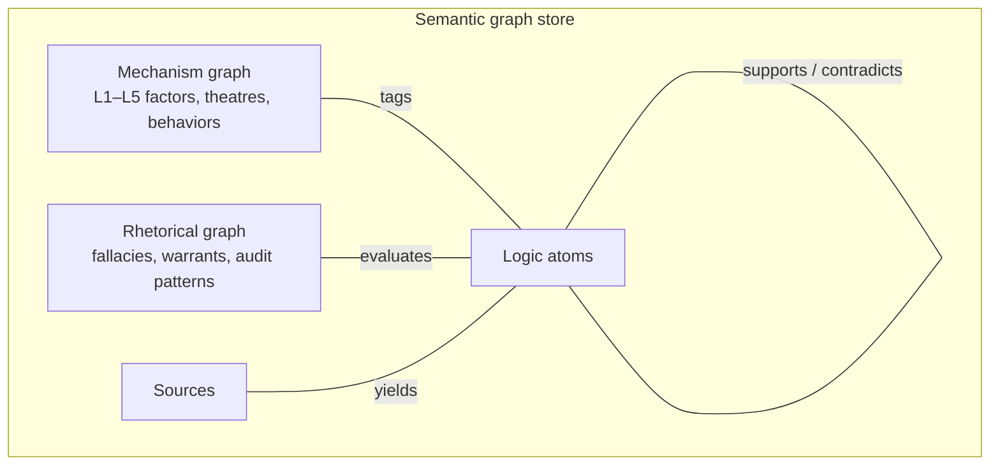

# Hanani Reasoning System — Architecture

**Goal:** A reusable, expandable **reasoning engine** — not a one-off analysis of today's
headlines. The system maintains **living semantic graphs**, ingests sources over time,
evaluates **logic atoms** through layered checks, and (later) synthesises assessments
and outcome narratives from the collective picture.

**Guiding question (unchanged):** What do all available reports imply when combined?

---

## What this is / is not

| This **is** | This **is not** |
|---|---|
| Expandable semantic graphs (mechanisms + rhetoric) | A single briefing on Ukraine or Hormuz |
| A pipeline that evaluates every logic atom exhaustively | Reputation-weighted source ranking |
| Versioned ontology that grows with evidence | Static prompt + one-shot LLM summary |
| Layered truth assessment (rhetoric → mechanisms → synthesis) | Moral or ideological verdict engine |

---

## Dual semantic graphs (one store, typed nodes)

Both graphs live in the **same graph store** with distinct node kinds and link types.
They are maintained independently but queried together during atom assessment.



### Graph A — Mechanism / factor semantics

**Purpose:** Tag logic atoms against **why** things happen in geopolitics — not just
observable variables (`hanani factors`) but analytical mechanisms.

- **Nodes:** layer concepts (security dilemma, prospect loss domain, costly signal, …),
  cross-cutting constructs (Schelling focal point, Jervis spiral), historical anchor
  templates, theatre scaffolds (Russia–Ukraine, Hormuz), behavioral pattern classes.
- **Edges:** `part_of`, `instance_of`, `implies`, `enables`, `contradicts`,
  `correlates_with`, `exemplified_by` (anchor), `observed_via` (link to operational factor).
- **Source of truth:** [`ontology/living-semantic-model.md`](ontology/living-semantic-model.md)
  (human-readable) + `hanani.ontology` + future `ontology/graph.json` (machine).
- **Expansion rule:** New nodes only with justification from audited atoms or cited
  scholarly mechanism — never from outlet prestige.

### Graph B — Rhetorical logic semantics

**Purpose:** Evaluate **how** arguments are made — fallacies, enthymemes, warrant
gaps, closure vs. inquiry — applied to **source text and each logic atom**.

- **Nodes:** fallacy types, audit criteria, argument roles (premise, warrant,
  conclusion, qualifier, rebuttal), robustness tiers, enthymeme patterns.
- **Edges:** `violates`, `exhibits`, `missing_warrant`, `supports_chain`,
  `undermines`, `subtype_of`, `detected_in` (atom or source).
- **Source of truth:** [`ontology/rhetorical-logic-graph.md`](ontology/rhetorical-logic-graph.md)
  + `hanani.rhetoric`.
- **Reputation-blind:** Nodes like `appeal_to_authority` fire when the **text** uses
  authority as warrant — never because the model "knows" the outlet.

---

## Reasoning engine — layered assessment pipeline

Each **logic atom** passes through **every applicable stage**. No shortcuts.

```
Source → [optional source-level rhetoric gate] → Atom extraction
  → Layer 1: Rhetorical / fallacy assessment (Graph B)
  → Layer 2: Mechanism tagging (Graph A) — exhaustive multi-tag
  → Atom assessment record (structured)
  → Merge into analysis graph (atoms + sources + concept hits)
  → [Phase 2] Per-atom narrative assessment summary
  → [Phase 3] Collective narrative + likely outcome scenarios
```

### Layer 1 — Rhetorical truth assessment (first gate)

**Input:** Atom text + local source context (not outlet name).

**Process:**
1. Map argument structure (premises, warrants, conclusion).
2. Traverse rhetorical graph: match fallacy patterns, enthymemes, closure signals.
3. Score chain completeness, falsifiability, update signals.
4. Emit `rhetoric_assessment`: pass / qualified / fail with explicit hits on Graph B nodes.

**Gate:** Atoms with `fail` may be stored but marked **inadmissible for mechanism inference**
unless user overrides. Weak sources do not propagate to hypothesis generation.

### Layer 2 — Mechanism semantic assessment

**Input:** Atoms that pass Layer 1 (or qualified with documented gaps).

**Process:**
1. Exhaustive tag against **all applicable** mechanism nodes (not default 1–2 tags).
2. Step-by-step justification per tag (text → concept).
3. Link to operational factors where observable (`troop-movements` ↔ costly signal).
4. Cross-link historical anchors as **templates**, not proof.
5. Record supporting/contradicting atoms in graph.

### Atom assessment record (per atom)

```json
{
  "atom_id": "Atom-001",
  "source_id": "src-…",
  "layer1_rhetoric": {
    "robustness": "Moderate",
    "fallacy_hits": ["cherry_picking"],
    "enthymemes": ["assumes adversary risk-neutral"],
    "admissible_for_inference": true
  },
  "layer2_mechanisms": {
    "tags": ["L1.security_dilemma", "L4.cheap_talk"],
    "justifications": {"L1.security_dilemma": "…"},
    "factor_links": ["diplomatic-signalling"]
  },
  "assessment_summary": null,
  "version": "0.2"
}
```

`assessment_summary` populated in **Phase 2** (human-readable per-atom digest).

### Phase 2 — Per-atom assessment summaries (planned)

Short structured summary: what the atom claims, rhetoric quality, mechanism tags,
confidence, conflicts with other atoms, what would falsify it.

### Phase 3 — Collective narrative & outcomes (planned)

Single narrative across **all admissible atoms** and sources:
- Corroboration and tension clusters
- Gaps in mechanism coverage
- **Most likely outcomes** that fit the largest admissible fact set and cohere with
  tagged behavioral patterns (prospect loss, brinkmanship, selectorate incentives, etc.)
- Explicit alternative scenarios and what evidence would discriminate them

Orchestrated via `hanani.workflow` + Milcah debate on structural confidence — not
a prose summary that skips the graph.

---

## Relation to existing modules

| Module | Role in reasoning system |
|---|---|
| `hanani.factors` | Observable variables — linked **from** mechanism tags |
| `hanani.ontology` | Mechanism graph seed (Layer 1–5 IDs) |
| `hanani.rhetoric` | Rhetorical graph seed (fallacies, audit criteria) |
| `hanani.graph` | Node/edge model, merge, query |
| `hanani.reasoning` | Pipeline stages Layer 1 → Layer 2 → assessment |
| `hanani.workflow` | Schedules ingestion, reasoning batches, Milcah, trace |
| Milcah | Debate on hypothesis confidence after graph build |
| Tirzah | Memory over ingested reports and past atom assessments |
| Galeed | Inspectable trace of every layer hit |

---

## Implementation phases

| Phase | Deliverable | Status |
|---|---|---|
| **0** | Mechanism ontology v0.1 + rhetorical graph seed + this architecture | **current** |
| **1** | Graph store + Layer 1 & 2 engine (atom in → assessment record out) | next |
| **2** | Source ingestion registry + atom extraction hooks | planned |
| **3** | Per-atom assessment summaries | planned |
| **4** | Collective narrative + outcome scenario generator | planned |
| **5** | Gap-driven retrieval loop + ontology versioning automation | planned |

---

## Versioning

- **Mechanism ontology:** `ontology/living-semantic-model.md` — version in header.
- **Rhetorical graph:** `ontology/rhetorical-logic-graph.md` — separate version line.
- **Engine contract:** `hanani.reasoning.REASONING_VERSION` — pipeline schema bumps.

Changelog entries record **stability** (concepts unchanged across cycles) vs.
**shift** (new nodes, revised edges, deprecated fallacy patterns).